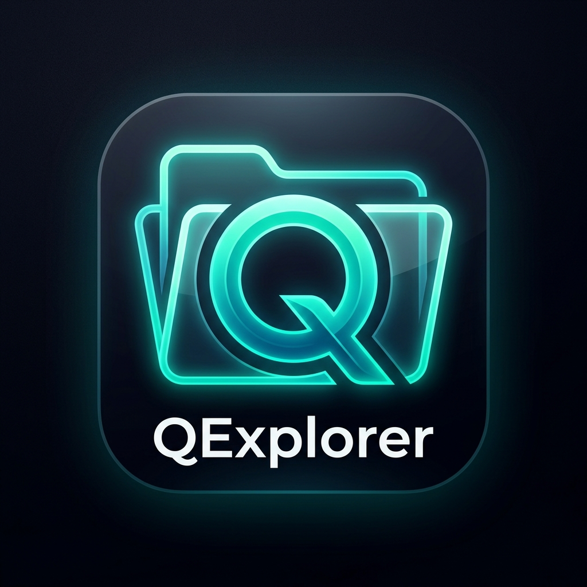

# QExplorer - Premium Android File Manager 📁✨

**QExplorer** là ứng dụng quản lý tập tin hiện đại, tối giản và cao cấp dành cho hệ điều hành Android. Ứng dụng được viết hoàn toàn bằng **Kotlin** và **Jetpack Compose**, mang lại trải nghiệm người dùng mượt mà, trực quan cùng thiết kế màu sắc Obsidian Dark & Clean Light thời thượng.

---

## 🎨 Logo & Nhận diện thương hiệu

Ứng dụng sở hữu logo thiết kế theo phong cách Glassmorphism với gam màu Neon Cyan/Teal sang trọng, biểu trưng cho sự hiện đại và tốc độ:

<p align="center">
  
</p>

---

## 🌟 Tính năng nổi bật

- 📊 **Thống kê dung lượng trực quan**: Biểu đồ tròn dung lượng mượt mà hiển thị tỷ lệ đã dùng/còn trống.
- 🗂️ **Bộ lọc danh mục nhanh**: Quản lý tệp tin theo nhóm: Hình ảnh, Video, Âm thanh, Tài liệu, Ứng dụng (APKs), Tải về.
- 📂 **Trình duyệt tệp tin phân cấp**: Duyệt thư mục với thanh điều hướng Breadcrumb thông minh và live search.
- 📝 **Trình chỉnh sửa văn bản tích hợp**: Soạn thảo và chỉnh sửa trực tiếp các tệp tin dạng văn bản (`.txt`, `.md`, `.json`, `.xml`, `.html`, `.kt`, `.java`...).
- 🤐 **Nén & Giải nén ZIP**: Hỗ trợ nén thư mục/tệp tin thành file `.zip` và giải nén trực tiếp nhanh chóng.
- 📈 **Thống kê định dạng chi tiết**: Thống kê dung lượng của từng đuôi mở rộng (JPG, PNG, PDF, ZIP...) kèm progress bar màu sắc.
- 🌗 **Chế độ nền động (Dark/Light)**: Chuyển đổi giao diện sáng/tối đồng bộ theo hệ thống hoặc tùy chọn của người dùng.

---

## 🛠️ Công nghệ sử dụng

- **Ngôn ngữ**: Kotlin (100%)
- **Giao diện**: Jetpack Compose (Material 3)
- **Kiến trúc**: MVVM (Model-View-ViewModel)
- **Điều hướng**: Compose Navigation 3
- **Lưu trữ cấu hình**: Android SharedPreferences & Kotlin StateFlow

---

## 📲 Hướng dẫn cài đặt

Bạn có thể tải trực tiếp file cài đặt APK tại đường dẫn sau:
👉 **[Tải file APK cài đặt (QExplorer Debug APK)](C:\Users\NQATECH\.gemini\antigravity\brain\53cd2898-afda-4ccb-90b4-a40cf3b92210\qexplorer-debug.apk)** *(Dung lượng khoảng 19.5 MB)*

---

## 🤝 Hướng dẫn tham gia phát triển (Contribution Guide)

Chúng tôi rất hoan nghênh sự đóng góp từ cộng đồng để giúp **QExplorer** ngày càng hoàn thiện hơn! Để tham gia đóng góp:

1. **Fork** dự án này về tài khoản GitHub cá nhân của bạn.
2. Tạo một **Branch** mới cho tính năng hoặc sửa lỗi của bạn:
   ```bash
   git checkout -b feature/ten-tinh-nang-moi
   # hoặc
   git checkout -b fix/ten-loi-can-sua
   ```
3. Thực hiện thay đổi, lập trình và kiểm thử kỹ càng trên thiết bị/trình giả lập.
4. Commit các thay đổi tuân thủ quy chuẩn **Commit Lint** dưới đây.
5. Push branch lên GitHub fork của bạn:
   ```bash
   git push origin feature/ten-tinh-nang-moi
   ```
6. Tạo một **Pull Request (PR)** gửi đến nhánh `main` của dự án gốc.

---

## 📝 Quy chuẩn Commit Messages (Git Commit Lint)

Để giữ lịch sử commit luôn sạch sẽ, dễ đọc và tự động hóa quá trình sinh changelog, dự án áp dụng chuẩn **Conventional Commits**:

Cú pháp commit tiêu chuẩn:
```
<type>(<scope>): <description>

[body]

[footer]
```

### Các Loại Commit (`type`) hợp lệ:
*   `feat`: Thêm một tính năng mới (Feature).
*   `fix`: Sửa một lỗi (Bug fix).
*   `docs`: Thay đổi hoặc bổ sung tài liệu hướng dẫn (Documentation).
*   `style`: Thay đổi định dạng code (khoảng trắng, format, thiếu dấu chấm phẩy...) mà không làm thay đổi logic hoạt động.
*   `refactor`: Tái cấu trúc mã nguồn nhằm tối ưu hóa hiệu năng/độ đọc mà không sửa lỗi hoặc thêm tính năng.
*   `perf`: Cải thiện hiệu suất xử lý (Performance).
*   `test`: Viết thêm hoặc sửa đổi các bài unit/integration test.
*   `chore`: Các tác vụ nhỏ khác liên quan đến cấu hình build, công cụ hỗ trợ hoặc dependencies (Gradle, gitignore...).

### Ví dụ Commit chuẩn:
*   `feat(explorer): tích hợp tính năng nén thư mục thành file zip`
*   `fix(theme): khắc phục lỗi lệch màu chữ khi chuyển đổi dark mode`
*   `docs(readme): bổ sung quy chuẩn git commit lint và hướng dẫn đóng góp`
*   `chore(deps): nâng cấp thư viện compose navigation lên bản mới nhất`

---

## 👤 Thông tin tác giả

*   **Tác giả**: Nguyễn Quốc Anh
*   **GitHub**: [@nguyenquocanhz](https://github.com/nguyenquocanhz)
*   **Email**: *nguyenquocanhz@gmail.com* (hoặc thông tin liên hệ của bạn)

Dự án được phân phối dưới giấy phép **MIT License**. Cảm ơn bạn đã quan tâm và đồng hành phát triển QExplorer!
